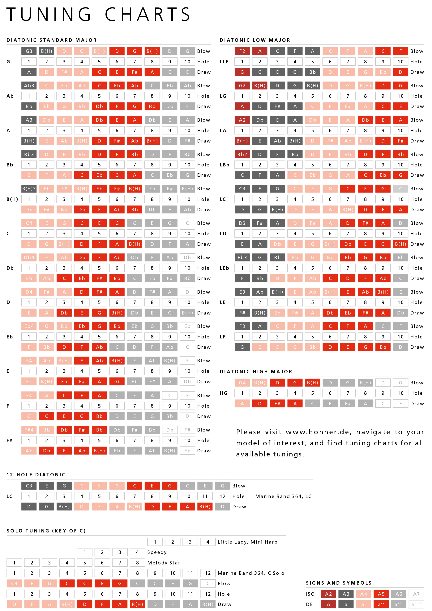

# Harmonica Tab Converter
This is a tab converter for harmonicas in different keys. Currently, it only supports conversion between the keys of 'C' and 'D'.

## How to Use
1. Clone this repository on your machine.
2. Make sure you have Ruby installed on your machine.
3. Run the 'main.rb' file in your terminal using the following command:

``` bash
ruby main.rb
```

4. Enter the tablature you wish to convert and press Enter.
5. The program will display the tablature converted to the selected key.

## Notes
This program has been created without any prior knowledge of music theory. It may evolve as the author learns. Please note that this program may contain errors or limitations. If you encounter any issues or have any suggestions, feel free to contact the author.

I'm using this scheme: 



Source: [playmusic123](https://www.playmusic123.com/blogs/news/harmonica-notes)

## License
This program is available under the MIT License. See the LICENSE file for more details.

